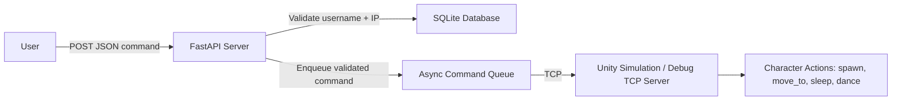

# Simulation Control Server

## Overview

The **Simulation Control Server** allows users to control characters in a Unity simulation in real-time via HTTP POST requests. Each user controls a character identified by a unique UUID, which is validated against their registered IP. Commands are queued asynchronously and sent over TCP to Unity or a debug server for testing.

This system enables multi-user interactions in a headless simulation environment while enforcing rate limits and ensuring secure access.
My final idea for this is to have a website where the simulation is livestreamed and gives users a curl template to send in requests to update and play in the simulation. 

---

## Architecture

1. User: Sends JSON commands via HTTP POST.
2. FastAPI Server: Validates requests, enforces rate limits, and enqueues commands.
3. SQLite Database: Stores user info: username, UUID, IP.
4. Async Command Queue: Holds validated commands for Unity.
5. Unity / Debug TCP Server: Receives commands and applies actions in the simulation.

---

## Goals

### User Management
- [x] Map user username + IP → UUID for each character.
- [x] Maintain user data in SQLite.
- [x] Max Players per IP
### Simulation Control API
- [ ] Accept and validate JSON commands.
- [ ] Support basic actions: spawn, move_to, sleep, dance.
- [x] Enforce per-IP rate limiting.
### Async Command Queue
- [x] Queue commands asynchronously for high performance.
- [ ] Send commands to Unity/debug TCP server over TCP.
### Extensibility
- [ ] Add new commands easily through a central API.
- [ ] Scale to multiple users and multiple characters